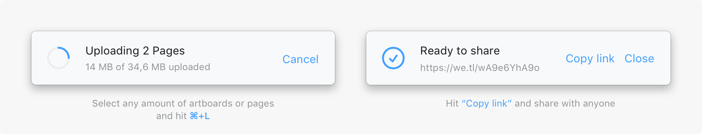
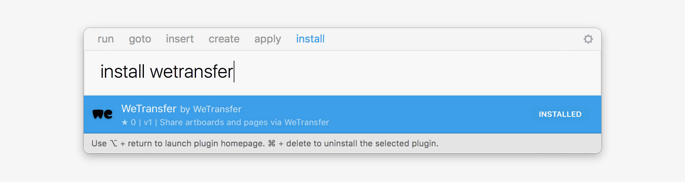

# Turn artboards into a WeTransfer Link
**The simplest way to send Sketch files around the world.   Simply hit `⌘+L` to share artboards or pages with a WeTransfer link.**

---

### Instructions:
Ready to share your big ideas? [Install](#installation) the WeTransfer plugin and choose from the following:

##### Shortcut
   - Select the artboards or pages you want to share
   - Hit `⌘+L`
   - Copy the link share it with anyone

##### Menu bar
  - Select the artboards or pages you want to share
  - Go to “Plugins” in the menu bar
  - Select “Share selection via WeTransfer”
  - Copy the link and share it with anyone

---

### Installation
#### Install with Sketch Runner
With [Sketch Runner](http://www.sketchrunner.com), just go to the `install` command and search for `WeTransfer`.

#### Manual installation
- Download the [latest release](../../releases) of the WeTransfer plugin
- Double-click the zip file “wetransfer.sketchplugin.zip”
- Open up “wetransfer.sketchplugin”
- Start sharing!

---

### Contact:
Feel free to send an email to sketch@wetransfer.com with any questions, comments or feedback